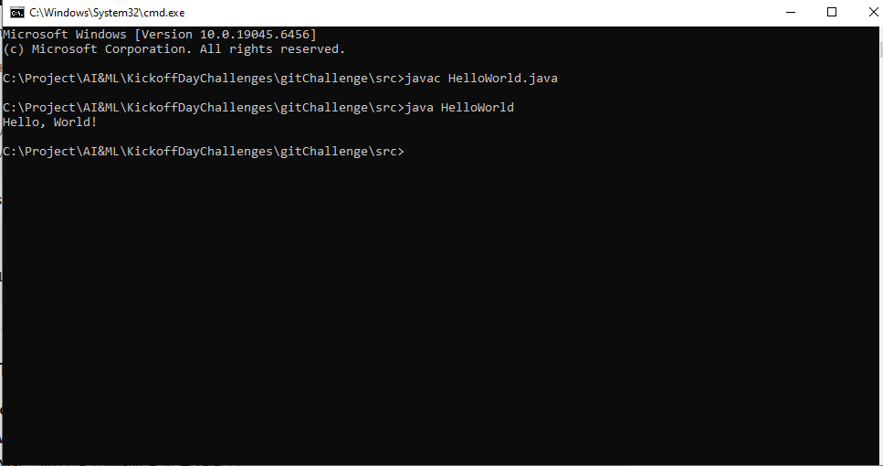

# 🌍 Hello World Project

## 📝 Description
This is a simple Java project that prints **“Hello, World!”** to the console.  

---

## 👤 Copyright
© 2025 **Chalana Wijerathne**. All rights reserved.

---

## ⚙️ Prerequisites
To run this program, ensure you have the following installed:
- [Java JDK 17 or higher](https://www.oracle.com/java/technologies/javase-downloads.html)
- A command line or terminal (Windows CMD, PowerShell, or Git Bash)

---

## 🚀 How to Run
Follow these steps sequentially:

```bash
# Clone the repository
git clone https://github.com/<your-username>/<repo-name>.git
cd <repo-name>

# Navigate to the source folder
cd src

# Compile the Java program
javac HelloWorld.java

# Run the program
java HelloWorld

```

